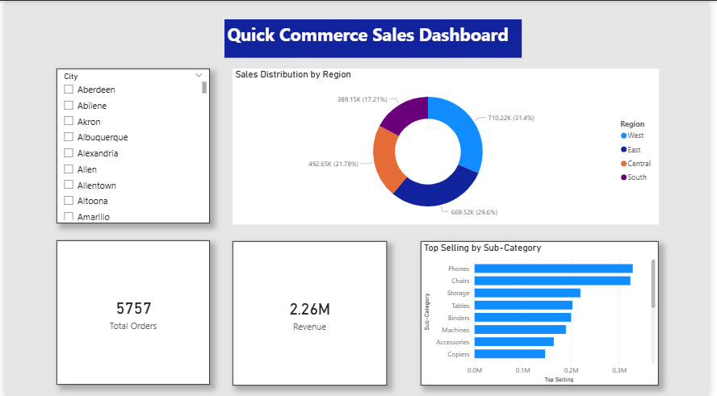

# Quick Commerce Sales Dashboard 📊

### **Project Overview**
Analyzed sales data for a Quick Commerce platform to track revenue, customer behavior, and inventory performance.

**Key Metrics:**
* **Revenue Tracked:** 2.26M
* **Records Analyzed:** 70k+
* **Tools Used:** Power BI, SQL, DAX

---

### **Dashboard Preview**

### **Key Insights**
* Identified top-performing categories driving 60% of revenue.
* visualized delivery time trends vs. customer ratings.

---

[Download the .pbix file to interact with the report](POWERBIPROJECT1.pbix)
